---

## title: The Walten Files 考察ノート

source: Notion

> [!note] 🧭 読み方（ナビゲーション）
> - 下の「目次」から各セクションへ移動できます。
> - 各セクション末尾の「考察」を先に読むと、全体を短時間で把握しやすいです。

> [!note] 🗂️ ざっくり全体像（先にここだけ）
> - 物語の中心は **1974年前後の連鎖事件** と **ソフィーの記憶（薬）** です。
> - アニマトロニクスは「魂／意識を閉じ込める器」として機能しうる描写があります。
> - Bon（および「灰色のBon」）の挙動は、誤認・探索・殺害の連鎖に接続します。

## ファイル1 — 会社紹介テープ（Company Introductory Tape）

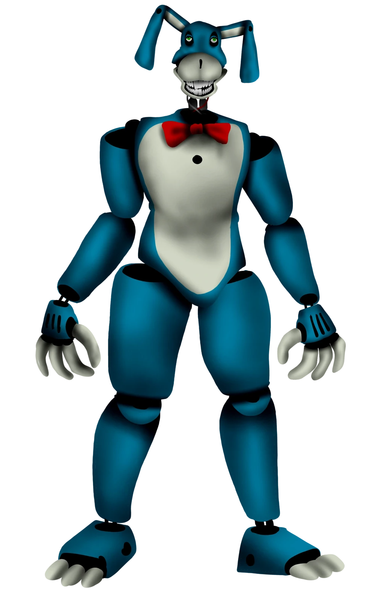

3本のテープの編集版で構成。「アンソニー」という人物が発見・編集したもの。

**小目次（ジャンプ）**

- [テープ1 — BSI新入社員向け紹介ビデオ（1974年）](#f1-t1)
- [テープ2 — 子ども向けアニメ「リトルボンのご近所」（1979年）](#f1-t2)
- [テープ3 — ブライアン・ステルズの施設調査録画（1982年10月10日）](#f1-t3)
- [ファイル1の考察](#f1-thoughts)

### テープ1 — BSI新入社員向け紹介ビデオ（1974年） {#f1-t1}

バニースマイルズ社（BSI）の新入社員に向けた明るい会社紹介ビデオ。レストラン「ボンズバーガーズ」で子どもたちを楽しませるアニマトロニクスバンド「ショーストッパーズ」（ボン、シャ、ブーズー、バニー）の管理を担当することが説明される。業務内容は清掃、ロボット修理、BSI技術の習得。創設者ジャック・ウォルテンとフェリックス・クランケンからの歓迎メッセージ。

**隠し要素：** テープ開始前に森の中のウサギ映像が一瞬映る。ナレーターが「ロボットのメンテナンスと修理」と言う時、声が不自然に低くなる。K-9保管施設の説明が挿入され、1974年のボンズバーガーズで「事件」があったことが示唆。灰色のウサギが逆再生で「もうすぐ彼らが迎えに来る、ソフィー」と語りかける。

### テープ2 — 子ども向けアニメ「リトルボンのご近所」（1979年） {#f1-t2}

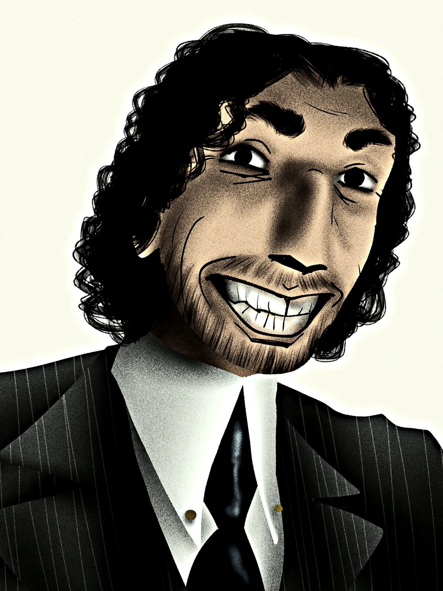

BSI傘下「サンライトアニメーション」制作の子ども番組。リトルボンが友達とお泊まり映画会を開くお話。

**隠し要素：** 招待客ビリーがジャック・ウォルテンに差し替わる。映画カバーにジャックの顔。テレビに「ここから出して」のテキスト。ソフィー・ウォルテン名義の処方薬。テレビがジャックの行方不明ポスター（1974年6月11日失踪）を表示。最後に「SOPHIE」の帽子をかぶった施設管理人が立ち、背後にボロボロのボンが立っている。

### テープ3 — ブライアン・ステルズの施設調査録画（1982年10月10日） {#f1-t3}

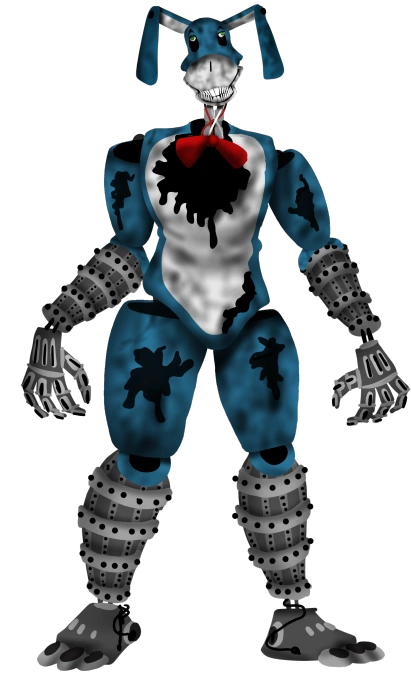

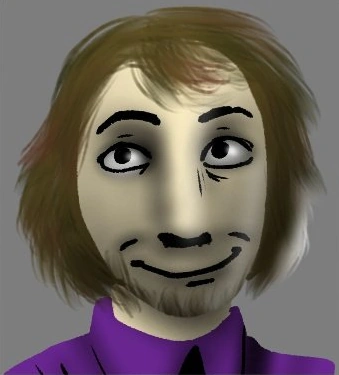

新施設管理人ブライアンがセントジョアナの森の旧BSI K-9保管施設を調査。4年放置された施設でボンのアニマトロニクスを診断中、ボンが突然動き出しブライアンを殺害。

**隠し要素：** 3枚の写真（フェリックス、従業員/家族、エド＆モリー・ウォルテン）。ボンの目が消え人間の目が浮かぶ。CGI顔認識アニメ（ボンがブライアンをソフィーと誤認）。遺体：顔はズタズタ、腕がもぎ取られている。画面テキスト「何も感じられない」「彼は私を彼女だと思った」。最後にジャックの不気味な笑顔とドビュッシー「月の光」。

### ファイル1の考察 {#f1-thoughts}

ボンの中には何者かの意識が宿っている（人間の目、勝手な動作）。ボンはソフィーを「探して」おり、似た人間を攻撃する。ジャックが「閉じ込められている」暗示が複数ある。ソフィーは父の失踪の真相に迫る中心人物として位置づけられている。全3テープが「仮面の下の恐怖」を段階的に暴く構造になっている。

---

## ファイル2 — Relocate Project（移転プロジェクト）

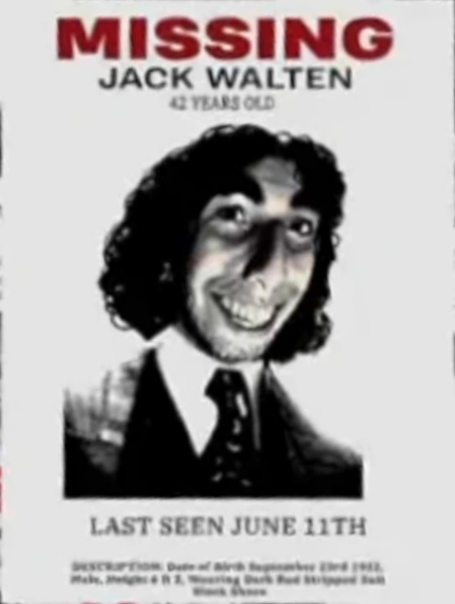

4本のテープで構成。すべて1978年前後に作成された、ボンズバーガーズの「移転プロジェクト」に関わる映像。

**小目次（ジャンプ）**

- [テープ1 — 移転プロジェクト説明ビデオ（1978年7月2日）](#f2-t1)
- [テープ2 — アニマトロニクス再プログラム映像（1978年8月13日）](#f2-t2)
- [テープ3 — K-9保管施設ツアーガイド（1978年7月9日）](#f2-t3)
- [テープ4 — 技術者3名による施設録画（1978年7月12〜14日）](#f2-t4)
- [ファイル2の考察](#f2-thoughts)

### テープ1 — 移転プロジェクト説明ビデオ（1978年7月2日） {#f2-t1}

1974年7月20日のボンズバーガーズ閉店後、4年の法的手続きを経て「移転プロジェクト」始動。フェリックス・クランケンがロボット修復・新レストラン開設を計画。

**隠し要素：** 冒頭に隠し動画「Lucky You」のリンク前半が一瞬表示。トラック運転手がジャック・ウォルテン。商品の中に「ジャック・ウォルテンの失踪」VHSボックス。フェリックス称賛の直後にジャックの不気味な画像が割り込む。

### テープ2 — アニマトロニクス再プログラム映像（1978年8月13日） {#f2-t2}

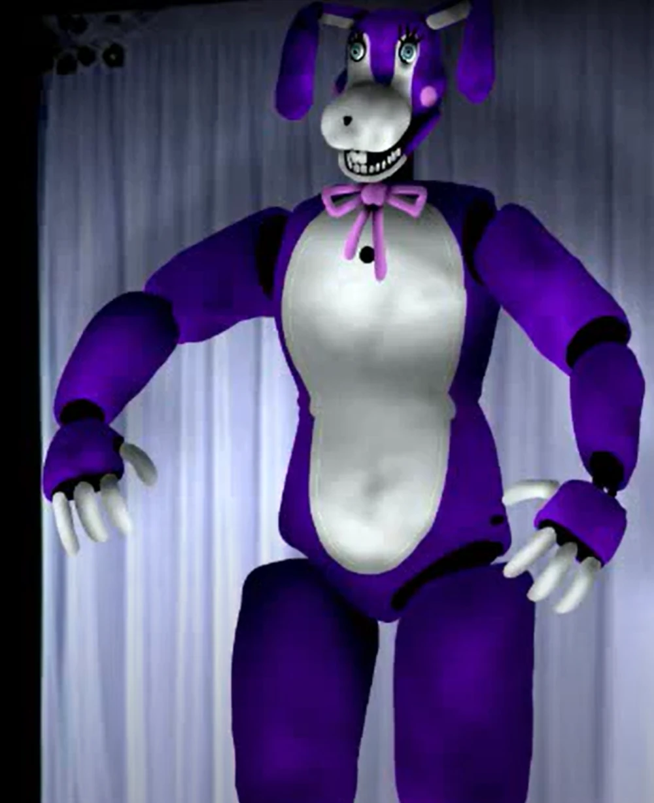

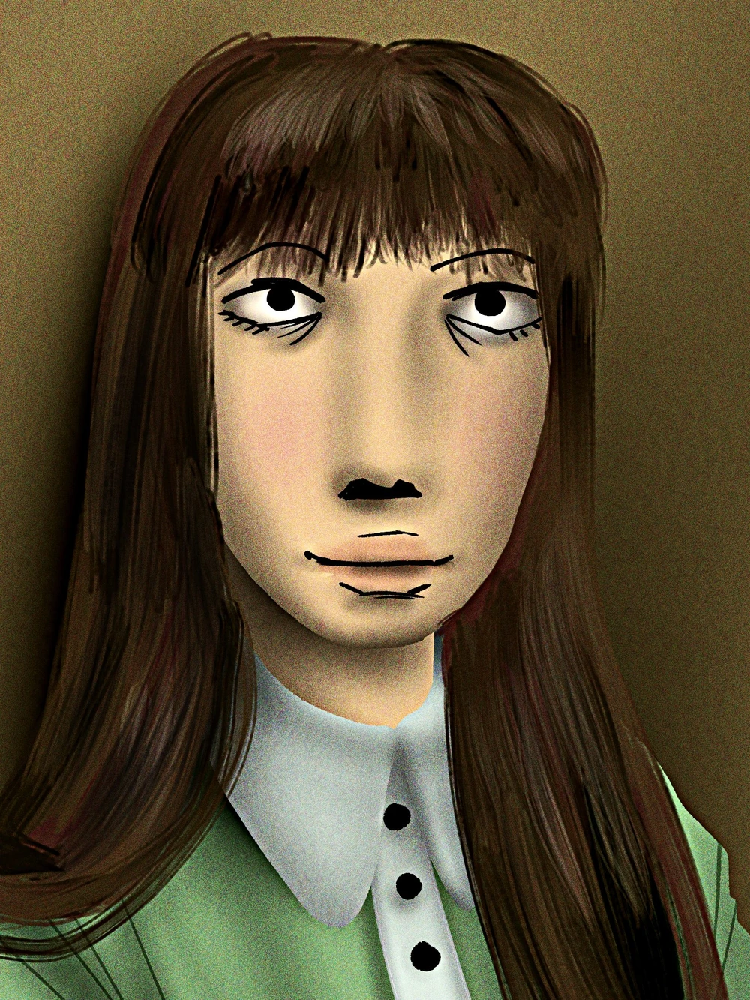

**隠し要素：** バニーの顔にスーザン・ウッディングスの不気味な顔が3回重なる。涙が黒くなる。野ウサギの白黒映像にモーツァルト「ラクリモーサ」。鳥かごの中の紫のウサギ。最後にスーザン・ウッディングスの行方不明ポスター。スーザンの魂がバニーに閉じ込められていることを描く。

### テープ3 — K-9保管施設ツアーガイド（1978年7月9日） {#f2-t3}

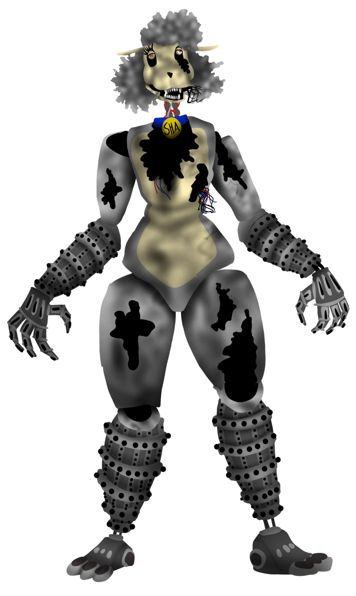

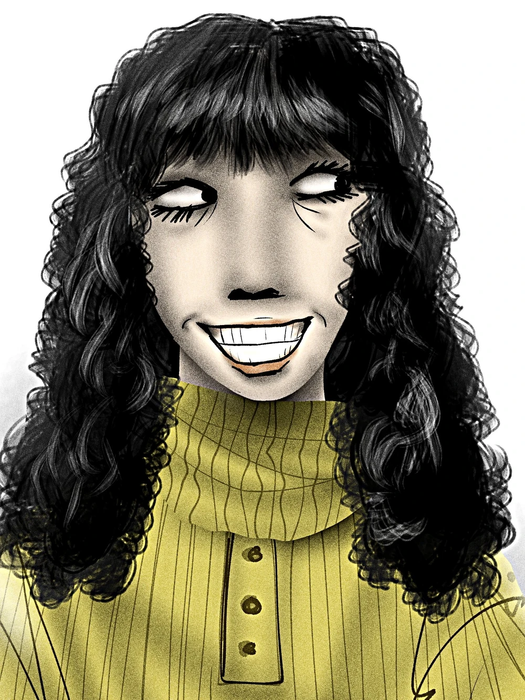

シャがガイドの施設ツアー映像。3つ目の保管庫ドアの説明で「隠すために——」と言いかけて途切れる。シャが迷い「ソフィー、ここはどこ？」と呟く。ローズマリーの物語：失踪した夫を探してレストランに通い、舞台裏から「彼の居場所を知ってるよ、ロージー」の声に誘い出される。ボン「ローズ、壊れてる。直してあげる。きれいにしてあげる」。「目覚めた時きれいだった。でも内側では体のすべてが出血しているようだった」。

**隠し要素：** ブライアンのBSI社員証が一瞬映る。リトルボンのリュックからジャックが覗く。シャドーマンが出現しシャの道を塞ぐ。シャとローズマリーが高速で切り替わる。ボンがローズマリーのバラバラの体をシャに詰め込むアニメ。ローズマリー・ウォルテンの行方不明ポスター。ローズマリーの魂がシャに閉じ込められていることを描く。

### テープ4 — 技術者3名による施設録画（1978年7月12〜14日） {#f2-t4}

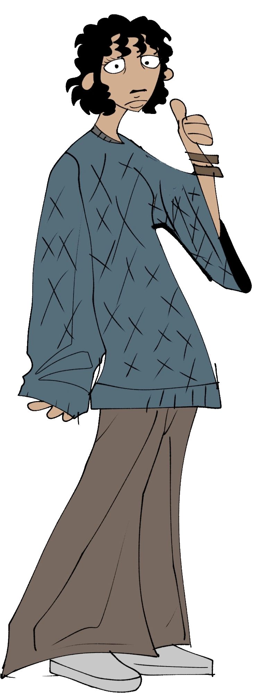

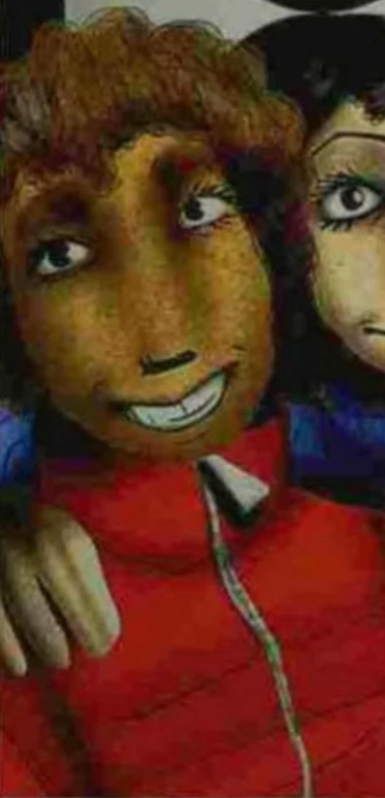

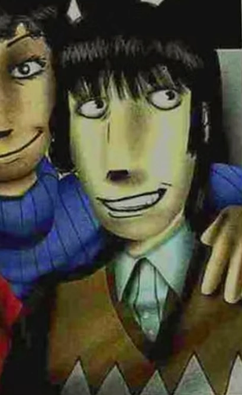

技術者ヒラリー・B、アシュリー・P、ケビン・Wが3日間滞在。ヒラリーがボンズバーガーズ閉店経緯を語る：深夜の音楽・照明、大人の女性の叫び声の報告で閉店。再プログラムは失敗。アシュリーが夜中に単独行動し、「バックドア」の奥でビリーのアニマトロニクスを発見。「06/11/7█」のカセットテープを再生→バースデーソング→「ジャック、スーザン、チャールズ、ローズマリー、ソフィー」。

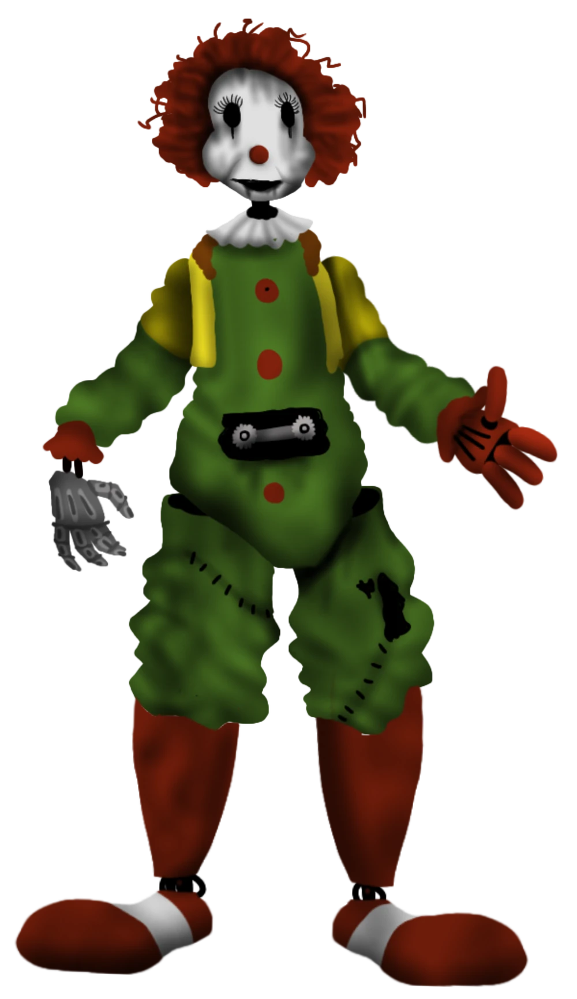

**隠し要素：** 懐中電灯が消え再点灯するとボンが目前に。アシュリーの叫び声。集合写真からヒラリーとケビンが消えアシュリーだけ残る（目が黒く、顔に血）。ビリー「やあ！僕はビリー、面白いおかしなピエロ」→逆再生メッセージ「盲目の占い師は知識に満ちているが文脈は決して持たない」。ボンの血まみれの手がビリーのマスクを剥がすとアシュリーのズタズタの顔。テキスト：翌朝ヒラリーとケビンはアシュリーが先に帰ったと思い込んだが実際はバックルームで叫んでいた。「彼女はもう叫んでいない。見てはいけないものを見た。今、彼女はきれいになった」。隠し動画「Lucky You」リンク後半。エンディング「影の男は明かりが消えた時に私を見る」。

### ファイル2の考察 {#f2-thoughts}

**犠牲者の全体像：** ジャック・ウォルテン→1974年失踪（ボンの中に？）。ローズマリー・ウォルテン→ボンに殺害されシャに詰め込まれる。スーザン・ウッディングス→バニーに閉じ込められている。アシュリー・パークス→ボンに殺害されビリーに詰め込まれる。チャールズ→詳細不明だが犠牲者リストに名前あり。

**ボンの行動パターン：** 人を殺しアニマトロニクスに詰めることを「きれいにする」と表現。特定の人物を探す目的があるが、誰でも殺害する危険性を持つ。

**ローズマリー殺害の具体的描写（公式ブログより確定）：** ファイル3内で聞こえるローズマリーの悲鳴は、実際に彼女が殺害されている瞬間の音声。首を掴まれたまま足をもがれている状態とされる。これはアニマトロニクスの機械的な力による殺害であり、ボンの中の存在が意図的に人体を解体していることを示す。「きれいにする」という表現と実際の殺害の残虐さの間には著しい認知の乖離があり、ボンの中の存在の異常性を裏付けている。

**シャドーマンの存在：** アニマトロニクス内の魂や事件進行を監視・誘導している可能性がある存在。Bonの直接行動主体は「ボン」と名乗る霊体であり、シャドーマンを主制御者とは断定しない。

**ソフィーへの収束：** すべてのテープがソフィー・ウォルテンに収束。父ジャック失踪、母ローズマリーはシャに閉じ込められ、ソフィーが真相に迫る中心人物として物語の中心に据えられている。

---

## Lucky You（隠し動画／Relocate Projectの補足テープ）

シリーズ初の隠し動画。Relocate Projectの映像内に分割されたURLが隠されており、発見した視聴者のみがアクセスできる限定公開動画。2020年6月27日公開、尺は4分4秒。ソフィー・ウォルテンに向けたメッセージで構成されている。

**小目次（ジャンプ）**

- [年表パート](#ly-timeline)
- [語りパート（音声メッセージ）](#ly-voice)
- [テキストパート（二人目の語り手）](#ly-text)
- [Lucky Youの考察](#ly-thoughts)

### 年表パート {#ly-timeline}

写真付きの日付が連続表示される。06/28/1974：Bon's Burgers開店日。06/30/1974：最初の誕生日パーティー（スーザン・ウッディングスの失踪日と同日）。07/10〜07/19/1974：閉店前最後のショー。07/20/1974：閉業。10/31/1974：建物が使用禁止（ボンが窓越しに見える）。12/10/1974：K-9保管施設の外観。01/23/1975：アニマトロニクス（ボン、ブーズー、シャ、バニー）に「K-9」タグが付いた状態で保管。06/11/1974：画面は真っ暗（ジャックが最後に目撃された日）。

### 語りパート（音声メッセージ） {#ly-voice}

不明な人物がソフィーに語りかける。「見たものに混乱しないで。怖がらないで、私の小さなうさぎちゃん。答えはいずれ与えられる。でも今ある断片だけでこのパズルを解こうとしないで。これはまだ始まりに過ぎない」「壊れた人々の、美しい人々の物語を語ろう」「彼は自分がしたことをとても後悔しているが、もうどうすることもできない。それを覚えておいて」。その後「Safety in pills, Sophie（ソフィー、薬の中に安全がある）」を繰り返す。この間、ブライアン・ステルズとアシュリー・パークスの最期の映像、Showbearの画像、ソフィー名義の処方薬ボトルが表示される。

### テキストパート（二人目の語り手） {#ly-text}

Al Bowllyの「Heartaches」が激しく歪んだ状態で流れる中、画面にテキストが表示される。「彼らを美しくした／やり方はわからない／そうするつもりもなかったのに／でもやってしまった」「彼らはアナログを通じて私たちに話しかけようとしている／彼らの声は届く／これは彼らの助けを求める叫び」「彼らはあの年に何が起きたか知ってほしがっている／でも私たちは忍耐強くなければ」「見て／彼らは生命に満ちている／音楽に合わせて踊る／笑い、歌う／彼らは完璧／彼らは美しい」「彼らはもうすぐあなたに会うだろう、ソフィー」。この間、Relocate Projectの壊れたアニマトロニクス（ボン、シャ、バニー、ビリー）の映像が挿入される。

### Lucky Youの考察 {#ly-thoughts}

語り手の正体：動画内には音声とテキストの二人の語り手が存在すると考えられている。音声の語り手は「私の小さなうさぎちゃん」という親しい呼びかけからジャック・ウォルテン（父親）説が有力だが、フェリックス・クランケンが三人称で自分を語っている説もある。「彼は後悔しているが何もできない」はフェリックスが5月2日の飲酒運転事故を指している可能性が高く、CyberFun Techでの発言と一致する。テキストの語り手は「彼らを美しくした」「そうするつもりはなかった」と語る点からボン説があるが、スーザン殺害の計画的な性質と矛盾するため、フェリックス本人という説もある（シリーズライターのEvaもこの説を支持）。

ソフィーの薬：ソフィー・ウォルテンは記憶喪失の薬を服用しており、これはフェリックスが1974年の事件（飲酒事故、一連の殺人）の記憶を消すために飲ませたものと推測される。「Safety in pills」は「薬を飲み続けろ＝真実を思い出すな」という警告。

Showbearの役割：Showbearは他のアニマトロニクスと異なり壊れた姿や血まみれの姿で描かれることがない。Lucky Youでは薬のボトル表示直前にShowbearの画像が現れ、目がストロボのように点滅する（催眠術的演出）。ただし、Lucky Youの語り手が薬の服用を勧めるのに対し、後のBunnyFarmではShowbearがソフィーに過去を「思い出させる」役割を果たしており、矛盾する。リトコンにより、この語り手はMr. Snowである可能性も。

「Heartaches」と認知症テーマ：動画内で使用される「Heartaches」（Al Bowlly）は、認知症をテーマにしたアルバム「Everywhere At The End Of Time」のオープニングトラックと同曲。ソフィーの薬による記憶喪失・過去の忘却を暗示。

日付の矛盾：K-9保管施設の写真は12/10/1974の日付だが、施設の看板には「Property of Cyberfun Tech 1975」と記載。ソフィーの混乱した記憶の反映か、制作上のミスか議論が続いている。また、ジャックは6/11/1974に失踪したはずだが、前エピソードには6/28/1974付のジャック署名の書類が存在し、フェリックスが偽造した可能性がある。

保管施設の匂い：1975年1月23日時点でK-9保管施設に悪臭はない。アニマトロニクス内の遺体がこの時点では除去されていたことを示唆。後にブライアン・ステルズが入った時に悪臭がしたのは、アシュリー・パークスの遺体がビリーに詰め込まれた後だから。

シリーズ全体における位置づけ：この短い隠し動画はシリーズの核心テーマ（記憶と忘却、罪悪感と贖罪、アニマトロニクスに閉じ込められた魂が「アナログ」を通じて真実を伝えようとする構図）を凝縮して初めて明確に提示した重要エピソード。タイトル「Lucky You」自体が皮肉めいた命名であり、真実に近づくほど「幸運」とは逆の現実が露わになることを示唆している。

## Guilty（隠し動画／BunnyFarmの補足テープ）

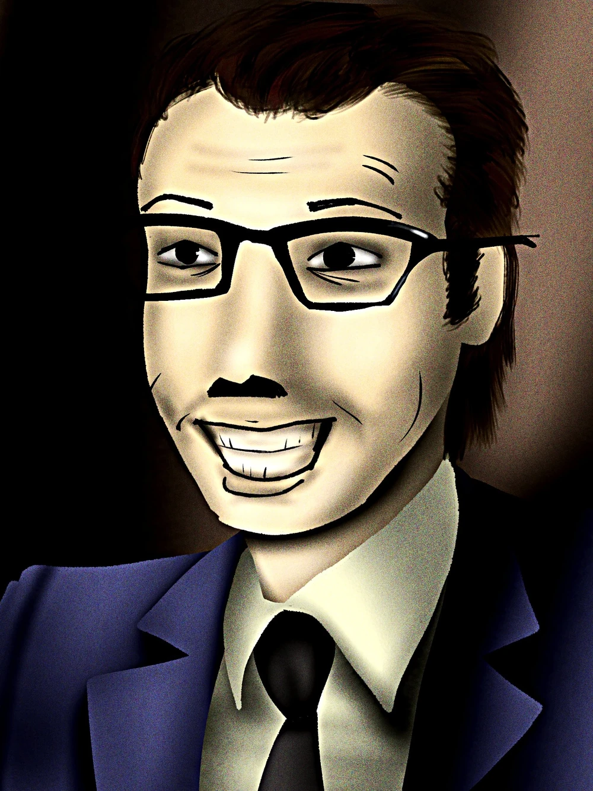

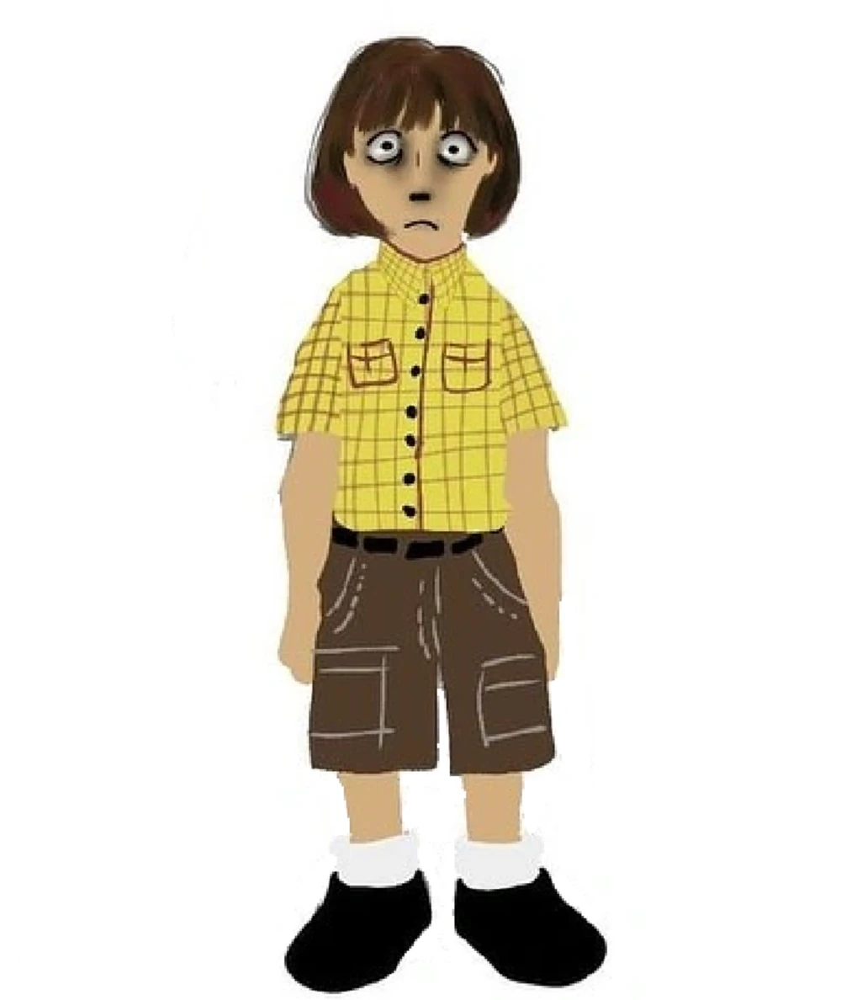

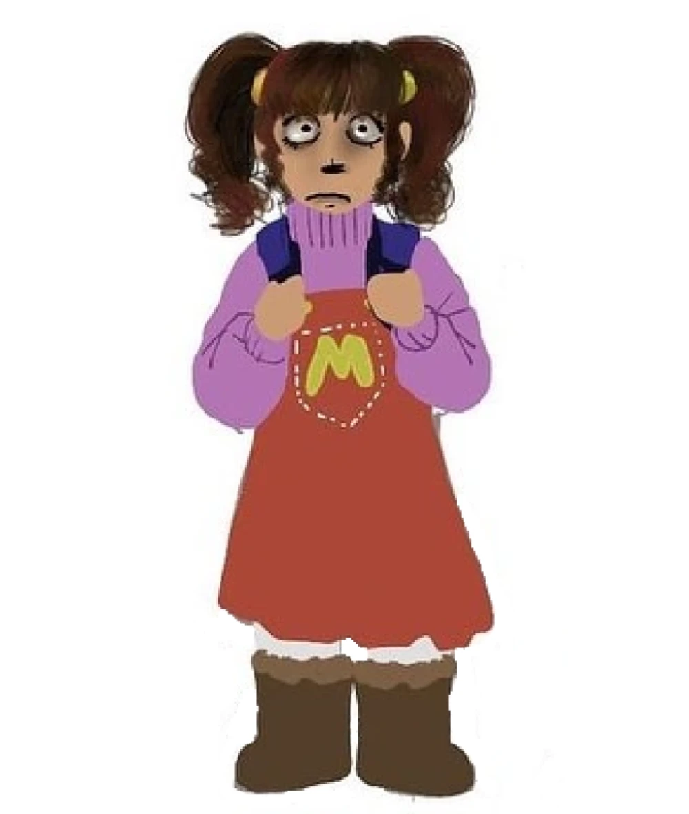

シリーズ2番目の隠し動画。BunnyFarm（ファイル3）内に隠されたリンクから発見できる限定公開動画。2020年10月16日作成、2021年3月19日一般公開。尺は7分4秒。フェリックス・クランケンの3つの異なる時期の音声録音で構成されており、彼の人格の変遷とエッド・モリー・ウォルテンの死の真相が本人の口から語られる。

**小目次（ジャンプ）**

- [動画の説明文（翻訳）](#guilty-desc)
- [録音1：会社の挨拶 — 1967年4月15日](#guilty-rec1)
- [録音2：12月のメッセージ — 1972年12月10日](#guilty-rec2)
- [録音3：ギルティ（罪） — 1974年5月2日](#guilty-rec3)
- [Guiltyの考察](#guilty-thoughts)

### 動画の説明文（翻訳） {#guilty-desc}

「エドワード・ウォルテン、モリー・ウォルテンを追悼して：エッド（12歳）とモリー（9歳）は1974年5月2日木曜日、致命的な自動車事故で亡くなった。春を祝う学校主催のパーティーから帰る途中だった。父親のジャック・ウォルテンは仕事のため子どもたちをパーティーに連れて行けず、ジャックの友人が代わりに連れて行った。帰路、ジャックの友人は問題のある状態（飲酒）で運転しており、セントジョアナの森の隣の道路付近で車を衝突させ、エドワードとモリーの命を即座に奪った。忘れないよ、私たちの小さな天使たち、私たちの小さな赤い子どもたち。」

### 録音1：会社の挨拶 — 1967年4月15日 {#guilty-rec1}

フェリックスがバニースマイルズ社の社員に向けて自己紹介と歓迎を述べる。友人ジャックと共に会社を立ち上げたこと、夢を叶えるには「希望」が大事だと語る。チームは小さく予算も少ないが、希望がある限り大丈夫だという前向きなメッセージ。フェリックスの写真と会社ロゴが表示される。

### 録音2：12月のメッセージ — 1972年12月10日 {#guilty-rec2}

フェリックスがBSI社員にクリスマスと新年の挨拶を送る。サイバーファンテック契約やボンズバーガーズプロジェクトの成功に誇りを持ち、「まさか私たちがここまで来られるとは」と感慨を述べる。フェリックスの写真、CyberFun Techのロゴ、Bon's Burgersのポスター、ブーズーのアニマトロニクスが表示される。

### 録音3：ギルティ（罪） — 1974年5月2日 {#guilty-rec3}

字幕に「車の衝突事故の後」と表示された後、フェリックスの告白が始まる。以下は音声の全文翻訳：

「よし、えっと……ああ、やらかした。ずいぶん久しぶりだ、こういうの使うの。前回これを使ったのは運転中だった……同じ状態で。やらかした。俺には問題がある。そしてこの問題はずっと前からあって、もう思い出せないくらいだ、初めて酔っぱらった時のこと。大抵のことは覚えていない。だからたぶんこのレコーダーをいつも持ち歩いてるんだ。だからたぶん今これを録音してるんだ。だって分かってる、明日になったら、これは全部ただの悪夢だと思うだろうって。エッドとモリーは大丈夫だって。でも……大丈夫じゃない。いいか？ 大丈夫じゃないんだ。あの子たちはまだ子どもだった。それにジャック……ああ神様、ジャックに何て言えばいい？ あいつは打ちのめされるだろう。だから埋めたんだ。ジャックがあの子たちに何が起きたか見る、その想像だけで……ジャックはこれまでで最高の親友だ。あいつにそんなことは絶対にしたくない。だから事故が起きた時、俺はただ……パニックになって、森に埋めたんだ。セントジョアナ。セントジョアナの森。道路の隣の森。事故が起きた道路の。どこに埋めたかすら思い出せない。ああ神様、完全にやばい。これからどうすればいい？ レストランは来月オープンする。大丈夫。大丈夫。お前は平気だ。全部うまくいく。」

映像要素：フェリックスの沈んだ表情の写真、高速道路、手をつないだ2人の赤い子ども（エッドとモリーの象徴）、セントジョアナの森、Bon's Burgersが表示。録音の最後にRocket（ロケット）が画面に現れ暗闇にフェードアウトし、Henry Hallの「Home (When Shadows Fall)」が流れる。録音中のBGMは「Into Each Life Some Rain Must Fall」（The Ink Spots ft. Ella Fitzgerald）でフェリックスの好きな曲とされる。

### Guiltyの考察 {#guilty-thoughts}

フェリックスの崩壊の軌跡：3つの録音は1967年→1972年→1974年と時系列順に並び、「希望に満ちた起業家」→「誇り高きリーダー」→「罪を犯し追い詰められた人間」への段階的な人格崩壊を描く。タイトル「Guilty（有罪）」はフェリックス自身の罪の告白そのもの。

飲酒事故と隠蔽の確定：フェリックスが酔った状態で運転し事故を起こし、エッドとモリーを死なせたこと、そしてパニックからその遺体をセントジョアナの森に埋めて隠蔽したことが本人の口から直接語られる。これはファイル1〜3での断片的な示唆を決定的に裏付ける証拠。

時系列の確認：「来月レストランがオープンする」という発言から、事故（5月2日）はBon's Burgers開店（6月28日）の約2か月前。フェリックスは事故直後から「大丈夫、全部うまくいく」と自分に言い聞かせて逃避しており、隠蔽を選んだことがジャック失踪→スーザン消息不明→ローズマリー殺害という連鎖的悲劇の起点となった。

レコーダーの意味：フェリックスは飲酒で記憶が飛ぶため常にレコーダーを携帯している。つまりこの告白録音自体も、翌日には「ただの悪夢」として忘れられる可能性がある。これはソフィー不穏な言葉として機能している。

---

## ファイル3 — BunnyFarm（テープ3／ゲーム記録）

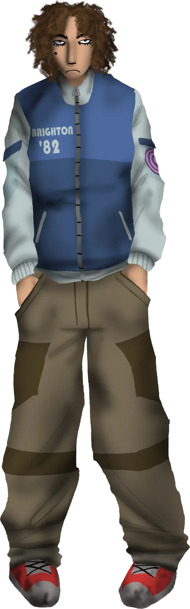

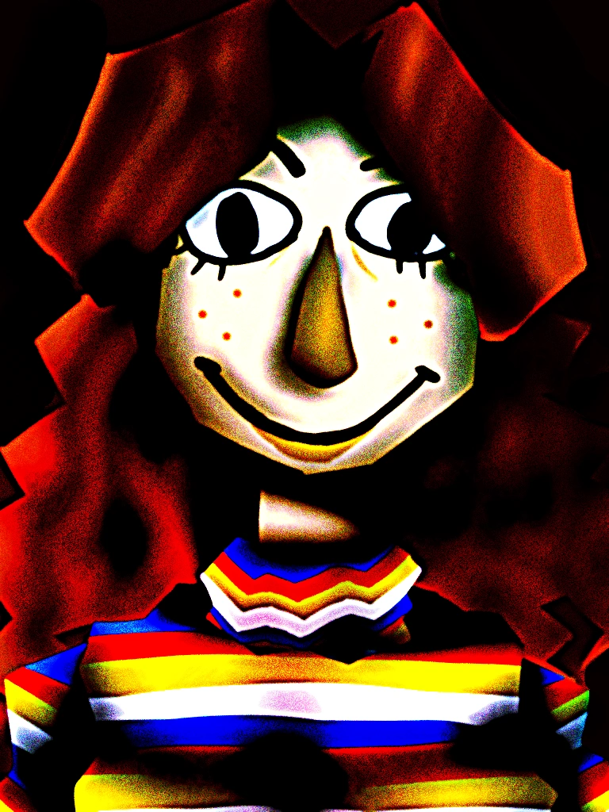

※内容は [[The Walten Files 3 - BunnyFarm 整理ノート]] の整理ノートを踏まえて要点化。

**小目次（ジャンプ）**

- [この動画の「外枠」構造（入れ子）](#f3-frame)
- [シーンごとの流れ（主要パート）](#f3-scenes)
- [判明した事実と人物関係（ファイル3での補強）](#f3-facts)
- [ファイル3の考察（物語上の役割）](#f3-thoughts)

### この動画の「外枠」構造（入れ子） {#f3-frame}

- **第1層：アンソニーのテープ（現実世界の語り手）**
  - アンソニーが入手した「テープ3」。BSIが1982年にブライトンへ配置した BunnyFarm ベータテスト筐体の記録映像（エントフェルント・ホテル宛）。
  - 映像は破損しており、アンソニーが友人と復元。
- **第2層：ソフィーとジェニーの実況（1982年）**
  - エントフェルント・ホテルの地下室で、ソフィー・ウォルテン（22）とジェニー・レターソン（26）がプレイ。
  - 二人の会話が"軸"になり、恐怖や違和感が現実側の反応として提示される。
- **第3層：ゲーム「BunnyFarm」の中身（1974年の出来事を反映）**
  - 児童向けの外見に反して、グリッチ／隠し演出で1974年の連続失踪・死亡事件を断片的に提示。

### シーンごとの流れ（主要パート） {#f3-scenes}

- **第1幕：導入とゲーム開始（0:44～8:45）**
  - ソフィーは名前入力を「Sop」で止めてしまう（"欠け"が最初から示される）。
  - アートワークに既視感を覚える。
  - ジェニーがBSIの不穏な噂（ブライアン失踪／アシュリー死亡の噂）を語る。
- **第2幕：一人プレイと最初のグリッチ体験（8:45～14:27）**
  - ゲームがクラッシュし、不気味な映像。
  - 翌日ジェニーが戻り、以前似た体験をしていたと明かす。
- **第3幕：破損セーブデータでの深掘り（14:27～19:45）**
  - ソフィーは"あえて"破損セーブデータをロード。
  - グリッチがランダムではなく、**対話（キャラクターとの接触）を契機に起きる**と見抜く。
  - 「何者か／誰かが、私に話しかけようとしている」感覚＝ゲームが"媒体"である示唆。
- **第4幕：スーザン・ウッディングスの音声ログ（20:03～21:14）**
  - 1974年6月30日の音声ログ。
  - 誕生日パーティー後の片付け、ジャック失踪後の開店への疑問、ロズマリー来店、ボンの異常（特に右腕）など。
  - 「一人で残り、バックステージで確認する」→その後の消息不明が示唆。
- **第5幕：ソフィーの内省と薬の告白（23:21～23:47）**
  - 服薬で10代／子ども時代の記憶が大量に消えている。
  - 薬を飲み始めた理由は「考えたくない」。
- **第6幕：リンダ・トンプソンの日記（24:14～27:31）**

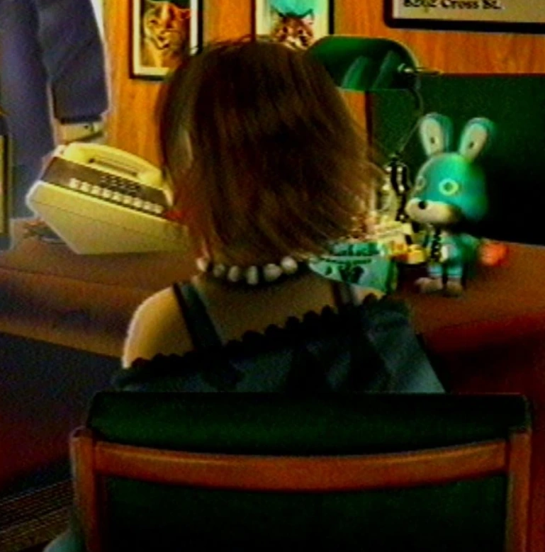

  - フェリックスとの関係（1964～1974）と、飲酒問題の悪化、別れの手紙（1974/5/2）が提示。
- **第7幕：失踪者たちの顔と記憶の覚醒（27:31～47:10）**
  - 行方不明表示、顔が思い出せないメッセージ。
  - ソフィーは映る"顔"が子どもの頃に知っていた人々であると認識。
  - **ロズマリー（母）の行方不明**、旧宅、学校のスプリングパーティー映像、エッド＆モリーの認識へと連鎖。
  - 「この顔、全部知ってる。全員知ってる」＝**自己同定（ウォルテン家の一員）** が成立。

### 判明した事実と人物関係（ファイル3での補強） {#f3-facts}

- **ウォルテン家**
  - ジャック失踪（ボン内部の遺体の可能性示唆が強化）
  - ロズマリー失踪（母であることが明示され、ソフィーの記憶回復の核に）
  - エッド＆モリー（"知っている顔"として回収される）
  - ソフィー（記憶消去＝服薬の存在が中心設定として確定）
- **BSI／周辺**
  - スーザン：音声ログで「事件直前」の状況が具体化（ボンの異常、単独確認）。
  - フェリックス：リンダの日記で人格・生活の崩壊と1974年の節目が補強。

### ファイル3の考察（物語上の役割） {#f3-thoughts}

- **"ゲーム"は単なる作品内作品ではなく、1974年の惨事を再生する「記憶喚起装置」** として機能。
- ソフィーの服薬＝記憶の封印に対して、BunnyFarmのグリッチは**外部からの介入（話しかけ）** として働く。
- ファイル1・2が「失踪／死／封印」の輪郭を作り、ファイル3がそれを**ソフィーの主観（覚醒プロセス）** へ接続することで、シリーズの中心軸が「ソフィーの回復と真相への強制接続」であることが確定する。

---

## フェリックス・クランケンの行動整理（ファイル1〜4＋補足情報）

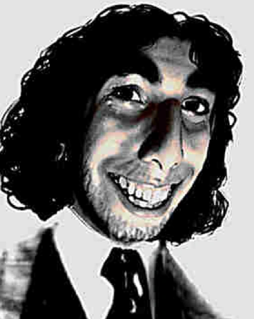

**小目次（ジャンプ）**

- [確定事実](#felix-facts)
- [仮説（未確定）](#felix-hypothesis)
- [Notion更新に基づく補足（2026-04）](#felix-notion-update)

### 確定事実 {#felix-facts}

- フェリックスが**飲酒運転で事故**を起こし、同乗していた**エッド・ウォルテンとモリー・ウォルテン（ジャックの子供二人）を死なせた**。
- その後、二人の遺体を**セントジョアナの森に隠蔽**した（K-9保管施設が後に設置される場所と同じ）。
- ジャックがエッドとモリーが帰ってこないことに気づき、電話や直接訪問でフェリックスに確認を取り始めた。
- フェリックスには深刻な飲酒問題があった（リンダの日記で1964〜1974年にかけて悪化が記録）。
- リンダ・トンプソンが1974年5月2日にフェリックスのもとを去っている。
- ジャック・ウォルテンは1974年6月11日に失踪。
- スーザンがボンの異常を確認しようとした夜（1974年6月30日）、フェリックスは来なかった。
- ジャック失踪後、フェリックスがBSIを単独で掌握し、移転プロジェクト（1978年）を主導。

### 仮説（未確定） {#felix-hypothesis}

- **ジャックがエッド・モリーの死の真相に辿り着いたため、フェリックスに排除された可能性** — 状況証拠的に筋は通るが、ジャックが死因を知ったという直接的な描写はなく、フェリックスがジャックを殺害したという確定的証拠もない。
- **フェリックス＝シャドーマン説** — 施設へのアクセス権、BSI掌握後の立場、他の魂（シャ＝ローズマリー）の行動を妨害する動機などから有力だが、確定には至っていない。
- **飲酒事故の隠蔽が、その後の連鎖的な事件（ジャック失踪→スーザン消息不明→ローズマリー失踪…）の起点になっている可能性** — 一つの罪を隠すために次の罪を重ねる構造。ただし各事件間の因果の直接的な証拠は個別に検証が必要。

### Notion更新に基づく補足（2026-04） {#felix-notion-update}

- **1974/05/03 深夜**、ジャックはフェリックス宅に押しかけ「子どもたちに何かしたなら殺す」とまで言及。フェリックスが強い恐怖を抱く十分な根拠があった可能性が高い。
- **1974/05/03 朝**、フェリックスは森で自殺を試みるが未遂。
- **1974/05/05**、フェリックスはジャックとローズマリーに「事故」を告げるが、遺体隠蔽や証拠隠滅まで話したかは不明。
- Rocket（エド＆モリー）の干渉描写により、**霊はアニマトロニクス以外（人形）にも宿りうる**作中ルールが補強される。

---

## souvenir（ティーザー動画）

2023年9月17日に公開された37秒間のティーザー動画。シリーズの次回作への布石として、K-9施設の天井から吊り下げられた複数のオブジェクトが映し出される。BGMには「Days of Wine and Roses」が使用されている。

**小目次（ジャンプ）**

- [映像に登場するオブジェクトとその象徴](#souvenir-objects)
- [考察ポイント](#souvenir-points)
- [シリーズ全体における位置づけ](#souvenir-position)

### 映像に登場するオブジェクトとその象徴 {#souvenir-objects}

天井から吊るされた各オブジェクトは、シリーズの登場人物を象徴していると考えられる。

ボトル2本 — フェリックス・クランケンを象徴。飲酒運転事故を起こした人物であり、アルコール依存の暗示。
看板（「JACK」の文字が確認可能） — ジャック・ウォルテンを象徴。BSIの共同創業者で失踪した人物。
工具類 — スーザン・ウッディングスを象徴。技術者であった彼女の職業的側面を反映。
彫像 — チャールズを象徴。詳細は不明だが、シリーズに登場する人物の一人。
花束 — ローズマリー・ウォルテンを象徴。名前の「Rose（バラ）」との関連が示唆される。
人形 — 対応する人物は不明。エドまたはモリーの可能性が指摘されている。

### 考察ポイント {#souvenir-points}

Bonの感傷的な行動 — 天井からオブジェクトを吊り下げるという行為は、Bonが犠牲者の「記念品（souvenir）」を保管しているかのように見える。殺害した相手への執着や罪悪感、あるいは支配欲の表れとも解釈できる。

「Days of Wine and Roses」の選曲意図 — ヘンリー・マンシーニ作曲のこの楽曲は、アルコール依存症がテーマの同名映画（1962年）の主題歌。フェリックスの飲酒問題と直接的に結びつく選曲であり、シリーズの根底にある「酒と破滅」のモチーフを強調している。

K-9施設との関連 — 映像の舞台であるK-9施設は、Relocate Projectで言及される保管施設と同一と推測される。アニマトロニクスの保管場所であると同時に、Bonが「記念品」を飾る私的な空間として機能している可能性がある。

タイトル「souvenir」の意味 — フランス語で「記念品」「思い出」を意味する。被害者の遺品を記念品として保管するという行為は、連続殺人犯の「トロフィー収集」行動と重なり、Bonの本質的な異常性を示唆している。

### シリーズ全体における位置づけ {#souvenir-position}

この動画はBunnyFarm（ファイル3）以降、約2年ぶりに公開されたコンテンツであり、シリーズの継続を示す重要なティーザーとなった。37秒という短さながら、K-9施設の内部をはじめて視覚的に提示し、各キャラクターの運命を暗示するオブジェクトの配置によって、ファンの考察を大いに刺激した。後に公開される「Spectacle」への直接的な伏線と位置づけられている。

---

## Spectacle（ミニエピソード）

2023年11月11日にWaltenewsチャリティ配信のために制作された4分11秒のミニエピソード。視聴回数は約60万回。Local 57のレポーター、クリスティン・マーシャルが閉鎖・立入禁止となったBon's Burgersの前から、レストランの歴史と一連の失踪事件について報道する形式をとる。作中設定では、アンソニーが「友人ジョシュアがデトロイトの古いテレビ倉庫から入手したニュースレポート」と説明している。

**小目次（ジャンプ）**

- [映像の内容](#spectacle-content)
- [考察ポイント](#spectacle-points)
- [シリーズ全体における位置づけ](#spectacle-position)

### 映像の内容 {#spectacle-content}

母親のインタビュー — ある母親が、同僚が誕生日祝いのためにBon's Burgersに行ったことを語り、レストランにまつわる超常現象の噂を信じていなかったと述べる。インタビュー中にはレストラン内部の映像やBon's Burgersコマーシャルの映像が挿入される。

デレック・コリンズのインタビュー — ブライトン警察署の主任刑事。1974年夏に起きた6件の失踪について語り、ジャック・ウォルテンの失踪が「転換点（breaking point）」だったと述べる。Local 57が失踪事件と超常現象を結びつけて「見世物（Spectacle）」にしていることへの不快感を表明する。

レストランの状況報告 — 夜間に大音量の音楽が流れる、車のアラームやライトがつけっぱなしにされるなどの不審な報告。閉鎖後、建物は立入禁止となり、都市伝説のせいで買い手がつかなかったが、不法侵入や破壊行為が繰り返されている。ローズマリー・ウォルテンとスーザン・ウッディングスの行方不明ポスターが映し出される。

結末の異変 — クリスティンが「Bon's Burgersの不気味な存在感（the disturbing presence of Bon's Burgers）」と言った瞬間に映像が一時停止し、助けを求めるくぐもった声（おそらくローズマリー）が聞こえる。ローズマリー・ウォルテンの霊体がスクリーンに近づき、歪んだ顔が一瞬映し出される。その後、Sha（アニマトロニクス）の上にローズマリーの顔が重なり、ステージ上のBonの隣に立つ。最後にローズマリーの顔が画面を埋め尽くし、「I'm still here（私はまだここにいる）」というテキストが表示される。

### 考察ポイント {#spectacle-points}

時系列の手がかり — クリスティンが「Bon's Burgersは4ヶ月前にオープンした」と発言しているため、このレポートは1974年11月または12月に収録されたと推定される（レストランは1974年7月頃オープン、10月末に閉鎖）。

「I'm still here」の顔の正体 — 前髪がないことや不気味な顔つきからジャック・ウォルテンだと誤解するファンが多かったが、作者側の関係者（EVA）により、この顔はローズマリーであると公式に確認されている。

タイトル「Spectacle」の二重の意味 — 作中でデレック・コリンズがLocal 57のレポートを「Spectacle（見世物）」と批判しているが、同時にBon's Burgers自体が恐怖の「見世物」と化していることへの皮肉でもある。

ローズマリーの存在とShaとの関係 — 結末でローズマリーの霊がShaの上に重なる描写は、彼女の魂がShaのアニマトロニクスに囚われている可能性を強く示唆する。「I'm still here」というメッセージは、彼女がまだレストラン内に存在し続けていることを訴えている。

Local 57の元ネタ — アナログホラーシリーズ「Local 58」（Kris Straub制作）へのオマージュの可能性が指摘されている。

1974年夏の6件の失踪 — デレック・コリンズが言及する「6件の失踪」は、ジャック、ローズマリー、スーザン、エド、モリーなどの失踪を指すとみられ、これらがすべてBon's Burgersの営業期間中に起きたことを裏付ける重要な証言。

### シリーズ全体における位置づけ {#spectacle-position}

souvenirに続いて公開されたこのミニエピソードは、シリーズ本編（TWF4 = CyberFun Tech）への繋ぎとなる作品。「ニュースレポート」という外部視点からBon's Burgers事件を描くことで、事件の社会的影響や世間の認知を初めて提示した。また、ローズマリーの霊的存在がより明確に描かれ、彼女がShaに宿っているという仮説を強化する重要なエピソードとなっている。Waltenewsチャリティ配信のために制作されたものであり、本編の時系列においては1974年末のニュース報道という位置づけ。

---

## 【訂正】Spectacleに関する既存記述

以下は Notion 追記に基づく訂正。

- 「I'm still here」を発している主体は **Rosemary Walten** と解釈するのが妥当。
- 終盤の「Rosemaryの顔がShaに重なる」演出は、**即断で“Shaに宿っている確定”とは言い切れない**。
- 過去のコミュニティで広がった「この顔はジャックでは？」という誤解は、作者側の言及で否定されている。

---

## ファイル4 — CyberFun Tech

2024年2月9日公開。シーズン1Bの第4話。CyberFun Tech Collection（3部作）のパート1。BunnyFarmに続く「発見されたテープ」形式だが、本作からはよりシネマティックな演出が主軸になる。主な時系列は1970年〜1974年7月1日、Susan Woodingsの死に至るまでの経緯を中心に描く。

**小目次（ジャンプ）**

- [① オープニング（1974年5月2日 スクールダンス）](#f4-01)
- [② Charles Brookのノート（1970年10月10日）](#f4-02)
- [③ Showstoppersのパフォーマンスとコンセプトアート解説](#f4-03)
- [④ BSI Consoleに関する2枚のノート](#f4-04)
- [⑤ WALKAROUND TEST（1974年1月21日）— Banny](#f4-05)
- [⑥ FACIAL TRACING（1974年3月7日）— Sha](#f4-06)
- [⑦ 1974年5月13日テスト — Rocket事件](#f4-07)
- [⑧ THE FIRST（1974年6月30日）— Susan殺害](#f4-08)
- [⑨ 1974年5月3日 午前0時23分 — JackがFelixの家へ](#f4-09)
- [⑩ 1974年5月3日 午前8時56分 — Felixの森・自殺未遂](#f4-10)
- [⑪ 1974年5月5日 — Felixの告白（自宅）](#f4-11)
- [⑫ 1974年7月1日 午前1時36分 — Wonderlandの会話](#f4-12)
- [Wikiから得られる補足情報・トリビア](#f4-trivia)
- [主要ポイントまとめ](#f4-summary)

## 全文翻訳（Wiki公式トランスクリプト準拠）

### ① オープニング（1974年5月2日 スクールダンス）

【演出】黒背景の画面を風船が落ちていく場面から始まり、巻き戻るとスクールダンスの夜だと判明。赤いプラスチックカップ、廊下、影から現れるEddとMolly、Rocketが入ったMollyのバックパックが映される。

Edward Walten：「ほら、Molly。行こう」

【スクールジム。「Brighton Community School SPRING PARTY EVENT」の看板】

Edd：「こっち！」「ほら、あそこにいるよ……」

【テーブルで酒を飲んで突っ伏しているFelixへと向かう。部屋の外には「ADULT ZONE No children allowed.（大人ゾーン 子供立入禁止）」の看板。場面は白くフェードし、一瞬Wonderlandが現れる】

【Bunny Smiles Incorporated Distributionロゴ→BSCロゴ→Bon's Burgers店頭→激しく踊るBon→ティッシュを口に咥えた子供→CyberFun Techロゴ。テープ巻き戻しでクリップ再現、Wonderland内にFelixの車、Sophie WaltenがJack Waltenの行方不明ポスターを見る瞬間も挿入。暗い部屋にShowstoppersの段ボール切り抜きと人形、「Cyberfun Tech」の文字。早送りでCyberFun Techロゴへ戻り、Video menuが現れる。選択肢：bons_burgers_promo／cybefun_programing_demo／sha_joint_movemeant／bsi_cleaning_procedure】

### ② Charles Brookのノート（1970年10月10日）

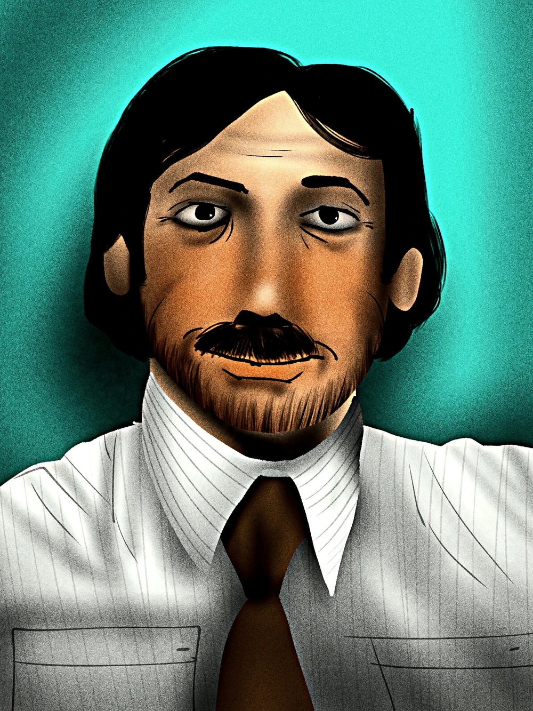

【BSI Employee Notebookが映され、以下が書かれている】

「やあ！『無名のBunny Smilesレストラン』のコンピュータ・スーパーバイザーとして正式に雇われたよ（自分でもいくつか名前を考えてるんだけどね）。彼らとはもう長い付き合いで、家族みたいなもんだ！Susanと一緒に何年も彼らの仕事を手伝ってきた、CyberFun Tech以前からね！WaltenたちとKrankenたちに会えたのはすごく楽しかった！働き始めるのが楽しみだ！未来は明るい」［P. 27:12］ -C.B.

※「P. 27:12」は聖書『箴言27章12節』（賢い者は災いを見て身を隠す、浅はかな者は進んで行って痛い目にあう）への暗示と考察されている。

### ③ Showstoppersのパフォーマンスとコンセプトアート解説

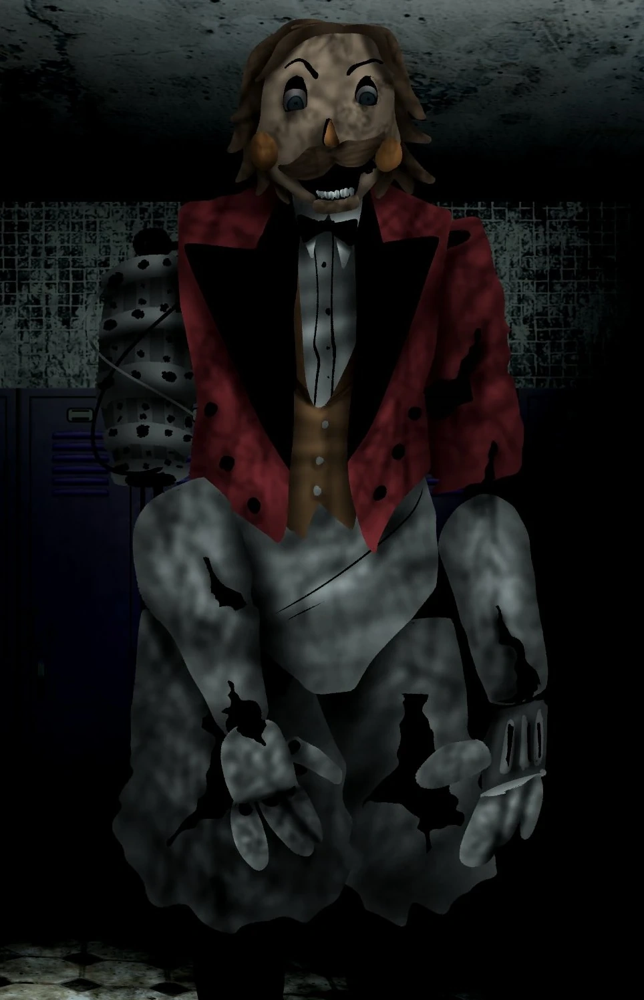

【Bon's Burgersのショー映像。「All I See is You」が流れ、ロゴ表示、観客の拍手、カーテンが開きShowstoppersが現れ「THE SHOWSTOPPERS」と表示される】

- Boozoo：「Tip Through the Tulips」（Sweet Tuesdayカバー版）／下部「BOOZOO」／庭にいる小型Boozoo
- Banny：「Drift Away」／下部「BANNY」／テーブルを囲む子供たち→カートゥーン版Bannyが花畑と目付きの太陽の中で跳ね回る
- 【グリッチ】食事エリア→Backstageドア→テープ再開
- Sha：「Sweet Music」／下部「SHA」／花を背景にしたカートゥーンSha
- Bon：「I Can't Feel Anything」／下部「BON」／森の映像とカートゥーン版が出るべき位置に赤い検閲が入る／「Bon」が一瞬映り、顔が一瞬現れる

→テープは「CBF-72」とラベルされたメカ頭部へ切り替わり、CyberTellyの声が聞こえる。

CyberTelly：「美しいだろう？これはCyberFun Techが作った最初期のメカモデルの一つだ……Bon's Burgersの魔法に命を吹き込むためのね！」

CyberTelly：「今日は、Showstoppersたちの魔法と、彼らがどのように作られたのかを巡る旅に出ます。我が社の品質について、何か新しいことを学べるかもしれませんよ」

CyberTelly：「これがShowstoppersです！Bunny Smiles Inc.の顔となる存在です。コンセプトアートは、優れたデザインに欠かせない非常に重要な工程です！素晴らしいアイデアがたくさん挙がりました」

CyberTelly：「Bunny Smiles Inc.のアート部門は、各キャラクターの複数のデザイン候補を選定し、皆さんがよく知る、愛されるデザインを生み出す役割を担っていました！」

【Rosemary Waltenの写真】

CyberTelly：「Rosemary Walten——［Jack Waltenの部分は遮断］の愛する妻であり、詩や演劇への深い情熱を持つ、優れたアーティストです！BSIのリードアーティストになる以前から数々の作品を手掛けてきました。今のキャラクターたちの最終デザインを担当したのが、彼女なのです！」

Rosemary Walten：「私の中では、それぞれのキャラクターがどんな見た目になるか、最初からかなり明確にイメージできていたと思います。私の中ではデザインは自然と頭の中で形になっていきました。若い世代に親しんでもらえるようにしたかったし……それでいて、覚えやすいシンプルさも大切にしたかったんです」

Susan Woodings：「Bunny Smilesは元々、アニマトロニクスの設計図を作ってもらうためにCyberFunに依頼したんです。でも、私たち全員がそのアイデアにのめり込んでしまって、結局BSIと完全に提携することになりました」

Susan：「私はSusan Woodings、BSIのリードテクニカル・エンジニアです——！」

【テープがグリッチして、複数の肩書きが連続表示される。SusanがCyberFun TechからBSIへ深く関与した人物であることを示唆】

Susan：「私たちはモデルに数えきれないほどの機能を追加しました……歩行能力や、観客と交流する能力さえ持たせることに成功したんです」

【Norman Pooltrickからの手紙が逆さま反転で表示。Susan失踪への疑義と、Felixへの照会が明記される】

Susan：「ここが、オーディオ・アニマトロニクスの全情報とコードが格納されている場所です。歩いたり、歌ったり、観客と交流したり、そういった機能のすべてですね。だからこそ、観客にとってあれほど生き生きと感じられるのです。コンソールは特定の人物や場所を認識することもできます」

### ④ BSI Consoleに関する2枚のノート

【1枚目：BSI Console】

「Bunny Smiles Incorporatedのコンソールは、Bon's Burgersのロボットをより生き生きとさせ、より楽しく印象的な体験を可能にする。これは野心的で革新的なコンセプトだと思う。自分の人生でこんなものを作るとは思わなかった。Susanは全く期待を裏切らなかった。実に見事で繊細な仕事だ。Jackは魅了されていた、こんなものは見たことがないと！Felixは感動と恐怖の両方を抱いていた、彼は仕組みを全く理解していない」

【2枚目：ウォークアラウンドテスト（第1〜2週）】

- 第1週：Bannyがテーブルを倒した。部屋認識機能を再調整。Bonのテストは良好。Boozooの手品は概ね成功。
- 第2週：Banny修理完了。Bonのウォークアラウンドは予想以上に良好。マスク破損と予備パーツの記録あり。

### ⑤ WALKAROUND TEST（1974年1月21日）— Banny

SusanとCharlesが実機テストを実施。Backstage内の障害物を避けて移動するはずのBannyはテーブルへ衝突し転倒。二人の会話から、初期段階では部屋認識がまだ不安定で、試行錯誤で調整していたことが分かる。

### ⑥ FACIAL TRACING（1974年3月7日）— Sha

顔追跡テストで、SusanとCharlesの認識は成功。会話内ではFelixの飲酒問題が示唆され、JackとRosemaryがその深刻さを把握していない可能性が語られる。技術検証の裏で、組織内の不穏な人間関係が同時に進行していることを示す場面。

### ⑦ 1974年5月13日テスト — Rocket事件

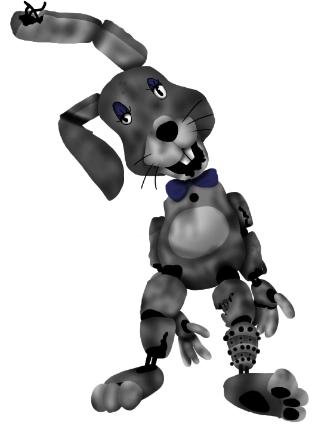

会話内で5月2日の事故と葬儀が言及される。FelixがRocket人形をBackstageに持ち込んでいたことが明らかになり、SusanとCharlesは関与を避けようとする。二人が去った後、Rocketが自律的に移動。コンソールはEdd/Mollyに対応する顔を捉えるが、通常認識に失敗しエラー表示となる。ここで霊的干渉とシステム表示の接続が初めて視覚的に示される。

### ⑧ THE FIRST（1974年6月30日）— Susan殺害

SusanはBackstageで単独点検中、暗所でBonに襲撃される。頭部拘束→顔面損傷→頸部致命傷という流れで殺害され、遺体は引きずられて画面外へ運ばれる。のちの文脈でBannyへの詰め込みと接続される、タイトル通り「最初の殺人」の中核場面。

### ⑨ 1974年5月3日 午前0時23分 — JackがFelixの家へ

JackはFelix宅へ押しかけ、怒号と懇願を繰り返す。終盤で「もしお前があの子たちに何かしたなら、俺はお前を殺してやる」と明言。Felixが後に語る恐怖感の背景として、極めて重要な直接描写。

### ⑩ 1974年5月3日 午前8時56分 — Felixの森・自殺未遂

森での埋葬痕、3つ目の穴、崖際での所持品投棄、飛び降り未遂までが連続で描かれる。事故後のFelixが「隠蔽」と「自滅」の間で揺れ続けていたことが具体化される。

### ⑪ 1974年5月5日 — Felixの告白（自宅）

Felixの独白で、JackとRosemaryに事故を伝えたこと、両者に憎まれている自覚、Rocketを処分できない恐怖が語られる。窓外やノック音と合わせ、Edd/Mollyの干渉が心理的恐怖として持続している演出。

### ⑩ 1974年7月1日 午前1時36分 — Wonderlandの会話

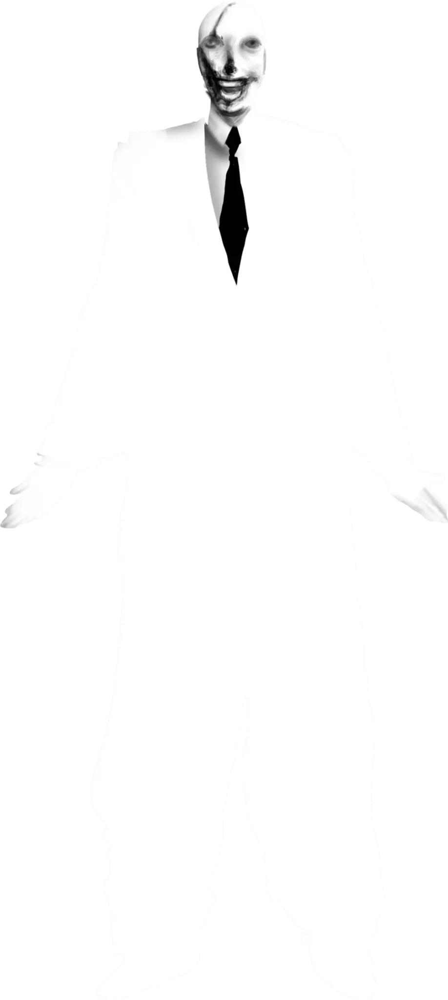

BonがSusanをBannyに詰め込む現実側描写と、Wonderland側での「Bon（灰色の存在）」の対話が並行する。ここで示される要点は次の通り。

- 「Bon（存在）」はアニマトロニクスBonとは別位相で振る舞う。
- Susanは死後直後の状態で、器への接続を勧められる。
- Edd/MollyはRocket側として介入し、Susanを守ろうとする立場を取る。

この場面により、「魂」「器」「誘導者」という作中ルールの輪郭が一気に明確化される。

## Wikiから得られる補足情報・トリビア

- 制作背景：本作は当初長尺構想だったが3部作に分割。シリーズ内で特に大規模な転換点と位置づけられる。
- オープニングの反復：Eddの「Come on, Molly. Let's go.」は冒頭と終端で対応し、循環構造を作る。
- VHSメニュー演出：本来の媒体挙動として不自然なUIを意図的に挿入し、メタ的違和感を強化。
- 「Bon」の常時出現：フレーム単位の出没で、物理映像と霊的層の混線を示唆。
- 顔認識テストの伏線：Sophie認識不安定の示唆が、Episode 1の誤認殺害（Brian誤認）と接続可能。
- Normanの手紙：外部企業（CyberFun）からBSIに対して正式疑義が向けられていた証拠。
- 時系列提示：断片構成だが、日付キャプションにより再構成可能。

## 主要ポイントまとめ

1. **Susan Woodingsの死の確定描写**：1974年6月30日、BackstageでBonに襲撃される。
2. **「Bon（灰色の存在）」の独立性**：機体Bonとは別概念として行動している。
3. **Wonderlandの法則**：魂は器との接続が重要で、誘導が行われる。
4. **Edd/MollyとRocketの導線**：霊的干渉が現実系システム表示にも現れる。
5. **Felixの心理と行動**：隠蔽、告白、恐怖、自殺未遂が短期間に連鎖。
6. **Jackとの対立の明文化**：5月3日の訪問場面が、失踪前夜の緊張を具体化。